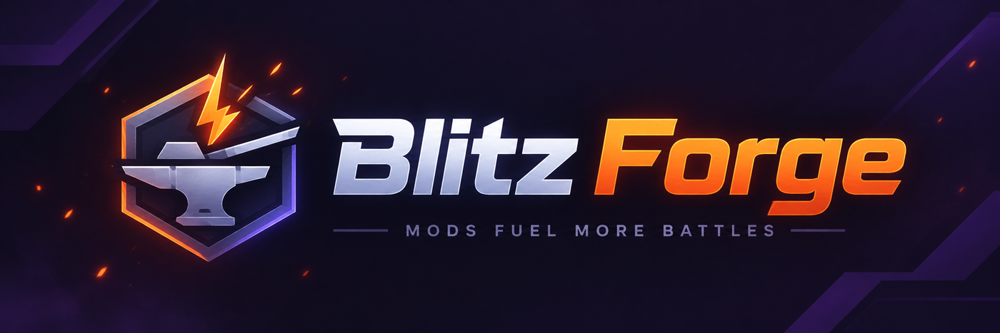

<p align="center">
  <a href="https://blitz-forge.org"></a>
</p>

<p align="center">
  <a href="https://github.com/PseudoJoker-1/blitzforge-platform/releases"></a>
  <a href="https://github.com/PseudoJoker-1/blitzforge-platform/releases"></a>
  <a href="https://blitz-forge.org/compat"></a>
  
  <a href="LICENSE"></a>
</p>

<p align="center">
  <a href="https://blitz-forge.org"></a>
  <a href="https://blitz-forge.org/download"></a>
  <a href="https://pd0-2.gitbook.io/blitzforge"></a>
  <a href="https://t.me/pseudojoker"></a>
</p>

<h3 align="center">Платформа модов для World of Tanks Blitz</h3>

<p align="center">
Загрузчик с замороженным C ABI, Lua-хост с фасадами <code>wotb.*</code>, каталог модов прямо в ангаре,
команда <code>wotbmod</code>, кнопка «Установить в игру» для браузера и портал с подписанными пакетами.<br>
<sub>BlitzForge is a mod platform for World of Tanks Blitz on Windows: a loader with a frozen C ABI, a Lua host, an in-game catalogue, a package CLI and a catalogue portal.</sub>
</p>

<p align="center">
  <a href="#для-игроков">Игрокам</a> ·
  <a href="#для-разработчиков-модов">Разработчикам</a> ·
  <a href="#что-внутри">Что внутри</a> ·
  <a href="#состав-репозитория">Репозиторий</a> ·
  <a href="#сборка">Сборка</a> ·
  <a href="#связь">Связь</a>
</p>

---

## Для игроков

1. Скачайте мастер установки с [blitz-forge.org/download](https://blitz-forge.org/download) и запустите его при закрытой игре. Он сам найдёт клиент через Steam, проверит сборку и поставит загрузчик, Lua-хост, команду `wotbmod` и каталог модов.
2. Запустите игру. В левой колонке ангара появится иконка каталога: вкладка «Каталог» ставит моды с портала одной кнопкой, вкладка «Кастомные моды» показывает всё, что вы положили в `mods\lua` сами.
3. Или откройте мод на [сайте](https://blitz-forge.org) и нажмите «Установить в игру»: браузер передаст ссылку `wotbmod://` установщику, он покажет права, зависимости и хеш и спросит подтверждение.

Каждый пакет подписан ключом разработчика и переподписан порталом после проверки модератором. Права мода видны до установки, а файлы игры, которые он меняет, возвращаются при удалении. Удаление всей платформы: «Приложения» Windows → BlitzForge.

## Для разработчиков модов

Мод — папка с `manifest.json` и `main.lua`. Панель в ангаре целиком:

```json
{
  "id": "my.hello",
  "name": "Привет из ангара",
  "version": "1.0.0",
  "developer": "ваш ник",
  "entrypoint": "main.lua",
  "permissions": ["core", "ui", "ui.create", "ui.modify.own", "battle.ui", "ui.modify.game"]
}
```

```lua
local panel = wotb.panel.new({
  id = "hello", width = 320, height = 90, anchor = "top-right", margin = 24,
  rows = { { text = "Привет, танкист" } },
})

function on_enable()  panel:mount()   end
function on_disable() panel:destroy() end
```

Положите папку в `<игра>\mods\lua\my.hello` и запустите клиент: правки `main.lua` подхватываются горячей перезагрузкой, сообщения идут в `wotb_mod_loader.log`. Панель рисуется штатными стилями клиента, а `wotb.ui.create` принимает классы, прототипы и YAML самой игры.

Релиз и публикация:

```
wotbmod keygen --key-id my-2026 --out %USERPROFILE%\.wotbmod\developer.key
wotbmod release my.hello -o release --sign-with-key %USERPROFILE%\.wotbmod\developer.key --key-id my-2026
wotbmod publish release\my.hello-1.0.0.release.json --to https://blitz-forge.org/api/v1 --token <токен>
```

Дальше: [первый мод за 15 минут](mod_api/docs/FIRST_MOD_15MIN_RU.md), [справочник Lua-фасадов](mod_api/docs/LUA_MODS_RU.md), [справочник C ABI](mod_api/docs/API_REFERENCE_RU.md), [формат пакета](mod_api/docs/WOTBMOD_PACKAGE_FORMAT_RU.md), [правила модерации](mod_api/docs/MODERATION_RULES_RU.md) и примеры в [`mod_api/examples`](mod_api/examples): `lua_facade_tour` (все фасады), `lua_native_ui` (родной вид), `cluster_picker` (штатные настройки), `night_mode` (ресурсный пакет), `catalog` (сам каталог).

## Что внутри

| | |
| --- | --- |
| **Загрузчик** | Proxy `version.dll` поднимает загрузчик в процессе клиента; MinHook-детуры на проверенных по fingerprint адресах, режимы хуков, изоляция сбоев мода от игры. |
| **C ABI 1.1** | `WotbModV3*` заморожен: вызовы, события, UI, камера, ресурсы, аудио, состояние машин и боя. Контракт зафиксирован снимком `rc1/contract_snapshot.json`. |
| **Lua-хост** | Фасады `wotb.panel`, `wotb.hud`, `wotb.battle`, `wotb.players`, `wotb.ui` (родной YAML, стили и прототипы клиента), `wotb.screen.mount_yaml`, `wotb.packages`; горячая перезагрузка, права по манифесту. |
| **Каталог в ангаре** | Штатный экран `Hangar.yaml`: моды с портала и свои папки в одном окне, установка, обновление, удаление, выключение и перезапуск клиента из игры. |
| **`wotbmod`** | Пакеты `.wotbmod`, подписи P-256, `install / update / rollback / enable / disable / sync / release / publish / restart-client`, ведомость установок с откатом. |
| **Launcher** | Схема `wotbmod://install/<id>@<версия>` для кнопки «Установить в игру» в браузере с показом прав и хеша. |
| **Портал** | Каталог, кабинет разработчика, модерация, совместимость со сборками, `index.json` для клиента и CLI. Backend на стандартной библиотеке Python + SQLite. |
| **Ресурсные пакеты** | Патчи DVPL с возвратом оригиналов (пример: `night_mode`). |
| **Мастер установки** | Inno Setup: проверка сборки клиента, зависимости, PATH, регистрация схемы, удаление через «Приложения» Windows. |

## Состав репозитория

| Папка | Что это |
| --- | --- |
| `mod_api/include` | Публичный C ABI (`WotbModV3*`), заморожен как API 1.1 |
| `mod_api/src`, `mod_api/loader` | Runtime и загрузчик (MinHook-детуры, fingerprint клиента, DAVA-бэкенд, Lua-хост) |
| `mod_api/tools` | Команда `wotbmod` (пакеты, подписи, каталог, `sync`), launcher `wotbmod://`, генераторы Lua-биндингов и документации |
| `mod_api/examples` | Примеры модов: фасады, родной UI, каталог, смена кластера, ночной режим, validation-мод |
| `mod_api/docs` | Документация на русском: статус API, известные ограничения, первый мод, правила модерации, playbook патча клиента |
| `mod_api/tests` | Тесты runtime, CLI, launcher, портала (`build.cmd` собирает и прогоняет всё) |
| `mod_api/release/public_preview` | Скрипты установки, удаления и проверки, `setup.iss` мастера |
| `wotbmod-portal` | Портал каталога: backend, шаблоны, деплой, тесты |
| `reanchor` | Переанкоровка адресов после патча клиента (рецепты `recipes.json`) |
| `mods/native-validation` | Validation-мод, который судит строки API вживую |
| `proxy_dll` | Proxy `version.dll`, поднимающий загрузчик в процессе клиента |

## Сборка

Нужны Visual Studio 2022 (x86 toolset) и Python 3.13.

```
cd mod_api
build.cmd                 # runtime, тесты, пакеты примеров (~10 минут)
loader\build_live.cmd     # DLL загрузчика и validation-мод для живого клиента
tools\build_public_preview.ps1 -SkipBuild -Version 0.1.0-preview.N   # набор для игрока (нужен Inno Setup 6)
```

Портал: `wotbmod-portal/run.cmd` локально, `wotbmod-portal/deploy/` для сервера. Перед деплоем `python tools/sync_sdk.py` подтягивает vendored SDK. Тесты портала: `python -m unittest discover -s wotbmod-portal/tests`.

В репозитории нет дампов, баз IDA и копий клиента, ключей подписи, `config.json` портала и его данных, сборочных артефактов. Публичные ключи доверия едут внутри набора для игрока.

## Статус

`0.1.0-alpha`: платформа работает на клиенте `11.20.0.887`, все интерфейсы API проверены на живом клиенте, кроме перечисленных в [`KNOWN_LIMITATIONS_RU.md`](mod_api/docs/KNOWN_LIMITATIONS_RU.md). После обновления игры набор перестаёт подходить, пока не выйдет версия под новую сборку; переанкоровка описана в [`CLIENT_PATCH_PLAYBOOK_RU.md`](mod_api/docs/CLIENT_PATCH_PLAYBOOK_RU.md).

Как участвовать: [`CONTRIBUTING_RU.md`](mod_api/docs/CONTRIBUTING_RU.md). Уязвимости: [`SECURITY_POLICY_RU.md`](mod_api/docs/SECURITY_POLICY_RU.md).

## Связь

- Telegram автора: [@pseudojoker](https://t.me/pseudojoker)
- Сайт и каталог: [blitz-forge.org](https://blitz-forge.org)
- Документация: [pd0-2.gitbook.io/blitzforge](https://pd0-2.gitbook.io/blitzforge)

## Лицензия

Код распространяется по лицензии [MIT](LICENSE). MinHook: [BSD-2](proxy_dll/third_party/minhook/LICENSE.txt); остальные сторонние компоненты перечислены в [`THIRD_PARTY_NOTICES.txt`](mod_api/THIRD_PARTY_NOTICES.txt).

BlitzForge — независимый проект сообщества. Он не связан с Wargaming и не одобрен ею; World of Tanks Blitz — товарный знак своего правообладателя.
